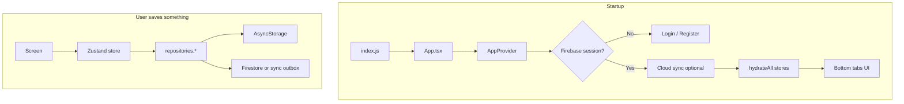

# RMSH Rentals — Project Guide

Simple map of how the app is built, where code lives, and how data flows.

**Also read:** [ARCHITECTURE.md](./ARCHITECTURE.md) for design choices (Zustand, repositories, Firebase).

---

## What this app does

Mobile fleet manager for a car rental business:

- Cars, customers, rentals (assign / extend)
- Rent installments (daily / weekly / monthly billing)
- Fines and accidents
- Dashboard stats and earnings views
- Optional **Firebase Auth + Firestore** sync; works **offline** on device storage

---

## How the app runs (flow)



1. **AppProvider** — auth bootstrap, optional cloud sync, hydrate all stores, wrap UI (Paper, safe area, bottom sheets).
2. **Screens** — never call AsyncStorage directly; use stores + `repositories`.
3. **Writes** — store → offline-first repository → local JSON + cloud/outbox.
4. **Full sync** — More → Sync now → `offlineFirstSyncOrchestratorService`.

---

## Source folders (`src/`)

| Folder | Role |
|--------|------|
| **`app/`** | App shell: navigation stacks/tabs, theme tokens, `AppProvider` |
| **`core/`** | Shared engine: types, repositories, sync, Firebase, business **services**, helpers, hooks |
| **`features/`** | One folder per business area (cars, customers, rentals, …) — screens, stores, repos |
| **`shared/`** | Design-system UI, layouts, modals, bottom sheets, media pickers |
| **`reusable/`** | Small cross-screen widgets (search bar, earnings list cards) |
| **`assets/`** | Images (e.g. logo) |
| **`types/`** | Global TypeScript declarations |

**Import aliases** (`babel.config.js`): `@app`, `@core`, `@features`, `@shared`, `@reusable`.

---

## Navigation

| Tab / area | Stack | Main screens |
|------------|-------|----------------|
| Dashboard | `DashboardStack` | Home stats, earnings breakdown, upcoming earnings this year |
| Cars | `CarsStack` | List (filters), details, add/edit car |
| Customers | `CustomersStack` | List (search), profile, add/edit |
| Rentals | `RentalsStack` | All rentals, rental details |
| More | `SettingsStack` | Settings, sync, fines, accidents |

Auth (when Firebase configured): `Login` / `Register` before tabs.

---

## Features (what each module owns)

| Feature | Path | Responsibility |
|---------|------|----------------|
| **auth** | `features/auth/` | Firebase login/register, session store |
| **cars** | `features/cars/` | Fleet CRUD, filters, car status from rentals |
| **customers** | `features/customers/` | Customer CRUD, profile, payment history |
| **rentals** | `features/rentals/` | Bookings list/detail, assign & extend flows |
| **payments** | `features/payments/` | Payment records store; no own tab (used everywhere) |
| **dashboard** | `features/dashboard/` | Stats, earnings screens, settings |
| **fines** | `features/fines/` | Fine list/form (car auto-filled from customer) |
| **accidents** | `features/accidents/` | Accident list/form (same car linking as fines) |

---

## Core services (business rules)

Pure functions — easy to unit test, no React imports.

| Service | File | What it does |
|---------|------|----------------|
| **Availability** | `availabilityService.ts` | Car status: available / on rent / upcoming booking; who is rented today |
| **Booking conflicts** | `bookingConflictService.ts` | Blocks overlapping rental dates on same car |
| **Rental billing** | `rentalBillingService.ts` | Builds installment schedule (daily/weekly/monthly), due dates |
| **Rental schedule** | `rentalScheduleService.ts` | Creates rental + payments from assignment input |
| **Extension booking** | `extensionBookingService.ts` | Max extend date when another booking exists after |

---

## Core helpers (shared calculations)

| Helper | Purpose |
|--------|---------|
| `rentalPayments.ts` | Paid totals, next rent due per car |
| `paymentInstallment.ts` | Due labels, sort, mark received / not paid labels |
| `upcomingEarnings.ts` | Pending rent by year, group by month for dashboard |
| `customerPaymentStatus.ts` | Customer “not paid” flag for list badges |
| `resolveCustomerCarId.ts` | Which car links to a customer (active → upcoming → latest rental) |
| `date.ts` / `historyDates.ts` | Format dates; min/max for date pickers |
| `bottomSheetSnapHeight.ts` / `screenBottomInset.ts` | Sheet height and tab-bar clearance |

---

## Data layer

```
Screen → Zustand store → repositories.* (registry)
                              ↓
                    offlineFirst*Repository
                              ↓
              asyncStorage*Repository  +  Firestore / outbox
```

- **`repositoryRegistry.ts`** — single place to swap local vs API implementations.
- **Zustand** — in-memory UI cache; **persist** only for car list filter/search (`useCarFilterStore`).
- **Domain types** — `core/types/domain.ts` (Car, Customer, Rental, Payment, Fine, Accident).

---

## `shared/` vs `reusable/`

### `shared/` — app UI kit

| Area | Components |
|------|------------|
| **ui** | `AppButton`, `AppInput`, `StatusBadge`, `EmptyState`, `WeekdayPicker`, `ReadOnlyFormField`, `PaymentInstallmentActions`, `TimelineView`, `AppDatePickerModal` |
| **layouts** | `ScreenLayout`, `ScreenSection`, `ResponsiveContainer`, `screenStyles` |
| **modals** | `AssignmentModal`, `ExtendBookingModal` |
| **bottomSheets** | `AppBottomSheet`, `FilterBottomSheet` |
| **media** | `MediaUploader`, `ImageSlider`, `ImageViewerModal` |

### `reusable/` — list / earnings widgets

| Export | Purpose |
|--------|---------|
| `SearchHeader` | Search field + filter icon |
| `EarningsHireCard` | One hire row on earnings breakdown |
| `EarningsCarSectionHeader` | Collapsible car header on earnings list |
| `useDebouncedValue` | Debounced search text |

---

## Dashboard behaviour (quick reference)

| UI | Rule |
|----|------|
| **Upcoming earnings this year** | Sum of pending installments due in current calendar year |
| **Upcoming Bookings** | Cars with a future booking and **not** on rent today; opens Cars tab with that filter |
| **Recent Bookings** | **5** newest rentals by `createdAt` (when record was created) |

---

## Environment (`.env`)

1. Copy `.env.example` → `.env` in the project root.
2. Fill in Firebase keys (and other flags).
3. Run `npm run sync-env` (also runs automatically on `npm start` / `ios` / `android`).
4. Restart Metro if it was already running: `npm start -- --reset-cache`.

`sync-env` writes `src/core/config/env.generated.ts` from `.env`. App code reads values via `src/core/config/env.ts`.

| Variable | Purpose |
|----------|---------|
| `APP_ENV` | `development` / `staging` / `production` label |
| `SHOW_DEV_DATA_TOOLS` | `true` to allow wipe UI in dev builds (`__DEV__` must also be true) |
| `FIREBASE_*` | Firebase Web SDK config |

`.env` and `env.generated.ts` are gitignored; `.env.example` is committed as a template.

## Firebase (optional)

1. Enable Email/Password auth and Firestore.
2. Add Firebase Web keys to `.env` (see `.env.example`).
3. Use rules from `firestore.rules.example`.
4. Sign in → **More → Sync now**.

Without Firebase keys in `.env`, the app runs local-only.

---

## Scripts

| Command | Description |
|---------|-------------|
| `npm start` | Metro bundler |
| `npm run ios` / `android` | Run app |
| `npm test` | Jest unit tests |
| `npm run lint` | ESLint |

---

## Tests

Located under `src/**/__tests__/` and `__tests__/App.test.tsx` — services (billing, conflicts, availability) and key helpers.

---

## Related files

- [README.md](./README.md) — install and CocoaPods notes
- [ARCHITECTURE.md](./ARCHITECTURE.md) — why Zustand/repos are structured this way
- [firestore.rules.example](./firestore.rules.example) — Firestore security template
