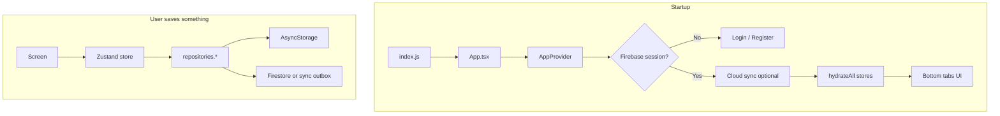

# RMSH Rentals — Project Guide

Simple map of how the app is built, where code lives, and how data flows.

**Also read:** [ARCHITECTURE.md](./ARCHITECTURE.md) for design choices (Zustand, repositories, Firebase) and [docs/SOURCE_MAP.md](./docs/SOURCE_MAP.md) for the file-by-file responsibility map.

---

## What this app does

Mobile fleet manager for a car rental business:

- Cars, customers, rentals (assign and close/update active rental end date)
- Rent installments (daily / weekly / monthly billing)
- Fines and accidents
- Dashboard stats and earnings views
- Optional **Firebase Auth + Firestore** sync; works **offline** on device storage

---

## How the app runs (flow)



1. **AppProvider** — auth bootstrap, optional cloud sync, hydrate all stores, wrap UI (Paper, safe area, bottom sheets).
2. **Screens** — never call AsyncStorage directly; use stores + `repositories`.
3. **Writes** — store → offline-first repository → local JSON + cloud/outbox.
4. **Full sync** — More → Sync now → `offlineFirstSyncOrchestratorService`.

---

## Source Folders (`src/`)

| Folder             | Role                                                                                      |
| ------------------ | ----------------------------------------------------------------------------------------- |
| **`app/`**         | App shell: navigation stacks/tabs, theme tokens, `AppProvider`                            |
| **`contextApis/`** | Theme and language providers/hooks used app-wide                                          |
| **`core/`**        | Shared engine: types, repositories, sync, Firebase, business **services**, helpers, hooks |
| **`features/`**    | One folder per business area (cars, customers, rentals, …) — screens, stores, repos       |
| **`shared/`**      | Reusable app UI, layouts, modals, bottom sheets, media pickers                            |
| **`assets/`**      | Images (e.g. logo)                                                                        |
| **`locales/`**     | Translation JSON files                                                                    |
| **`network/`**     | Connectivity provider, gate, and offline screen                                           |
| **`error/`**       | Error boundary, fallback screen, and error logging/normalization                          |
| **`zustand/`**     | Global UI stores for loader, toast, modal, bottom sheet                                   |
| **`types/`**       | Global TypeScript declarations                                                            |

**Import aliases** (`babel.config.js`): `@app`, `@contextApis`, `@core`, `@features`, `@shared`, `@network`, `@error`, `@zustand`.

---

## Navigation

| Tab / area | Stack            | Main screens                                                |
| ---------- | ---------------- | ----------------------------------------------------------- |
| Dashboard  | `DashboardStack` | Home stats, earnings breakdown, upcoming earnings this year |
| Cars       | `CarsStack`      | List (filters), details, add/edit car                       |
| Customers  | `CustomersStack` | List (search), profile, add/edit                            |
| History    | `HistoryStack`   | Car picker and car rental timeline                          |
| More       | `SettingsStack`  | Settings, sync, theme/language, fines, accidents            |

Auth (when Firebase configured): `Login` / `Register` before tabs.

---

## Features (what each module owns)

| Feature       | Path                  | Responsibility                                                                                      |
| ------------- | --------------------- | --------------------------------------------------------------------------------------------------- |
| **auth**      | `features/auth/`      | Firebase login/register, session store                                                              |
| **cars**      | `features/cars/`      | Fleet CRUD, filters, car status from rentals                                                        |
| **customers** | `features/customers/` | Customer CRUD, profile, payment history                                                             |
| **rentals**   | `features/rentals/`   | Rental store/repository/types; assignment and end-date updates are launched from car/customer flows |
| **payments**  | `features/payments/`  | Payment records store; no own tab (used everywhere)                                                 |
| **dashboard** | `features/dashboard/` | Stats, earnings screens, settings                                                                   |
| **fines**     | `features/fines/`     | Fine list/form (car auto-filled from customer)                                                      |
| **accidents** | `features/accidents/` | Accident list/form (same car linking as fines)                                                      |
| **history**   | `features/history/`   | Car rental history picker and monthly timeline                                                      |

---

## Core services (business rules)

Pure functions — easy to unit test, no React imports.

| Service                    | File                            | What it does                                                                     |
| -------------------------- | ------------------------------- | -------------------------------------------------------------------------------- |
| **Availability**           | `availabilityService.ts`        | Car status: available / on rent / upcoming booking; who is rented today          |
| **Booking conflicts**      | `bookingConflictService.ts`     | Blocks overlapping rental dates on same car                                      |
| **Rental billing**         | `rentalBillingService.ts`       | Builds installment schedule (daily/weekly/monthly), due dates                    |
| **Rental schedule**        | `rentalScheduleService.ts`      | Creates rental + payments from assignment input                                  |
| **Update rental end date** | `updateRentalEndDateService.ts` | Validates and updates active rental end date without overlapping future bookings |

---

## Core helpers (shared calculations)

| Helper                                              | Purpose                                                           |
| --------------------------------------------------- | ----------------------------------------------------------------- |
| `rentalPayments.ts`                                 | Paid totals, next rent due per car                                |
| `paymentInstallment.ts`                             | Due labels, sort, mark received / not paid labels                 |
| `upcomingEarnings.ts`                               | Pending rent by year, group by month for dashboard                |
| `customerPaymentStatus.ts`                          | Customer “not paid” flag for list badges                          |
| `resolveCustomerCarId.ts`                           | Which car links to a customer (active → upcoming → latest rental) |
| `date.ts` / `historyDates.ts`                       | Format dates; min/max for date pickers                            |
| `bottomSheetSnapHeight.ts` / `screenBottomInset.ts` | Sheet height and tab-bar clearance                                |

---

## Theme And Language

Theme and language are app-level contexts, not per-screen globals.

| Module                                      | Purpose                                                                |
| ------------------------------------------- | ---------------------------------------------------------------------- |
| `contextApis/theme/ThemeProvider.tsx`       | Stores `light` / `dark` mode, exposes `colors`, `paperTheme`, `isDark` |
| `contextApis/theme/useThemeContext.ts`      | Hook every screen/component should use for runtime colors              |
| `app/theme/colors.ts`                       | Source palettes for light and dark mode                                |
| `app/theme/paperTheme.ts`                   | React Native Paper themes derived from app palettes                    |
| `contextApis/language/LanguageProvider.tsx` | Stores current language and updates i18n                               |
| `locales/en.json`                           | English strings; English is currently the only selectable language     |

Rule: shared style modules like `screenStyles.ts` and `modalFormStyles.ts` should remain theme-neutral. Apply colors inside components with `useThemeContext()` so dark mode updates everywhere.

---

## Data layer

```
Screen → Zustand store → repositories.* (registry)
                              ↓
                    offlineFirst*Repository
                              ↓
              asyncStorage*Repository  +  Firestore / outbox
```

- **`repositoryRegistry.ts`** — single place to swap local vs API implementations.
- **Zustand** — in-memory UI cache; **persist** only for car list filter/search (`useCarFilterStore`).
- **Domain types** — `core/types/domain.ts` (Car, Customer, Rental, Payment, Fine, Accident).

---

## Shared UI

| Area             | Components                                                                                                                                                                                                                                                     |
| ---------------- | -------------------------------------------------------------------------------------------------------------------------------------------------------------------------------------------------------------------------------------------------------------- |
| **ui**           | `AppButton`, `AppInput`, `AppDropdown`, `AppDialog`, `SearchBar`, `SearchHeader`, `SelectableList`, `CollapsibleSection`, `StatusBadge`, `EmptyState`, `WeekdayPicker`, `ReadOnlyFormField`, `PaymentInstallmentActions`, `TimelineView`, `AppDatePickerModal` |
| **layouts**      | `ScreenLayout`, `ScreenSection`, `ResponsiveContainer`, `screenStyles`                                                                                                                                                                                         |
| **modals**       | `AssignmentModal`, `SetRentalEndModal`                                                                                                                                                                                                                         |
| **bottomSheets** | `AppBottomSheet`, `FilterBottomSheet`                                                                                                                                                                                                                          |
| **media**        | `MediaUploader`, `ImageSlider`, `ImageViewerModal`                                                                                                                                                                                                             |

Rule: generic UI belongs in `shared/`, generic non-UI hooks/helpers belong in `core/`, and feature-specific UI belongs inside that feature.

---

## Dashboard behaviour (quick reference)

| UI                              | Rule                                                                                  |
| ------------------------------- | ------------------------------------------------------------------------------------- |
| **Upcoming earnings this year** | Sum of pending installments due in current calendar year                              |
| **Upcoming Bookings**           | Cars with a future booking and **not** on rent today; opens Cars tab with that filter |
| **Recent Bookings**             | **5** newest rentals by `createdAt` (when record was created)                         |

---

## Environment (`.env`)

1. Copy `.env.example` → `.env` in the project root.
2. Fill in Firebase keys (and other flags).
3. Run `npm run sync-env` (also runs automatically on `npm start` / `ios` / `android`).
4. Restart Metro if it was already running: `npm start -- --reset-cache`.

`sync-env` writes `src/core/config/env.generated.ts` from `.env`. App code reads values via `src/core/config/env.ts`.

| Variable              | Purpose                                                             |
| --------------------- | ------------------------------------------------------------------- |
| `APP_ENV`             | `development` / `staging` / `production` label                      |
| `SHOW_DEV_DATA_TOOLS` | `true` to allow wipe UI in dev builds (`__DEV__` must also be true) |
| `FIREBASE_*`          | Firebase Web SDK config                                             |

`.env` and `env.generated.ts` are gitignored; `.env.example` is committed as a template.

## Firebase (optional)

1. Enable Email/Password auth and Firestore.
2. Add Firebase Web keys to `.env` (see `.env.example`).
3. Use rules from `firestore.rules.example`.
4. Sign in → **More → Sync now**.

Without Firebase keys in `.env`, the app runs local-only.

---

## Scripts

| Command                   | Description     |
| ------------------------- | --------------- |
| `npm start`               | Metro bundler   |
| `npm run ios` / `android` | Run app         |
| `npm test`                | Jest unit tests |
| `npm run lint`            | ESLint          |

---

## Tests

Located under `src/**/__tests__/` and `__tests__/App.test.tsx` — services (billing, conflicts, availability) and key helpers.

---

## Related files

- [README.md](./README.md) — install and CocoaPods notes
- [ARCHITECTURE.md](./ARCHITECTURE.md) — why Zustand/repos are structured this way
- [docs/SOURCE_MAP.md](./docs/SOURCE_MAP.md) — file-by-file responsibility map
- [docs/I18N.md](./docs/I18N.md) — translation/language workflow
- [firestore.rules.example](./firestore.rules.example) — Firestore security template
