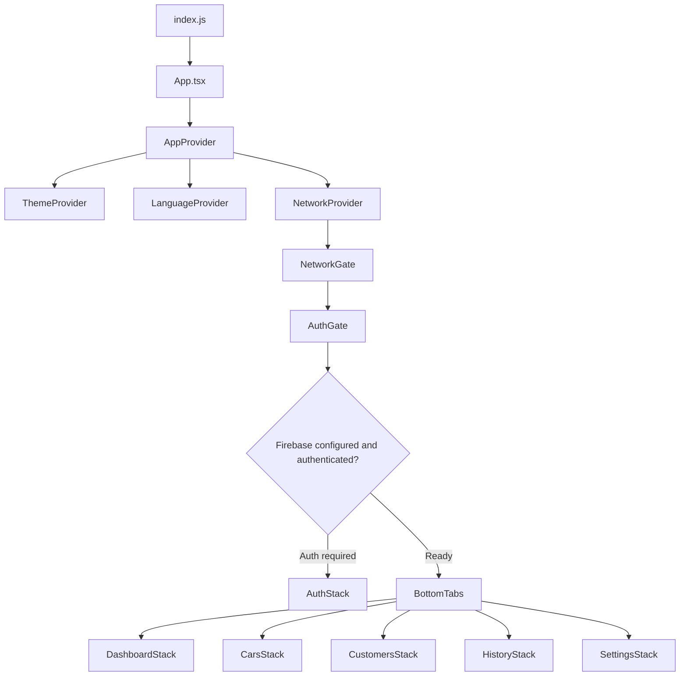
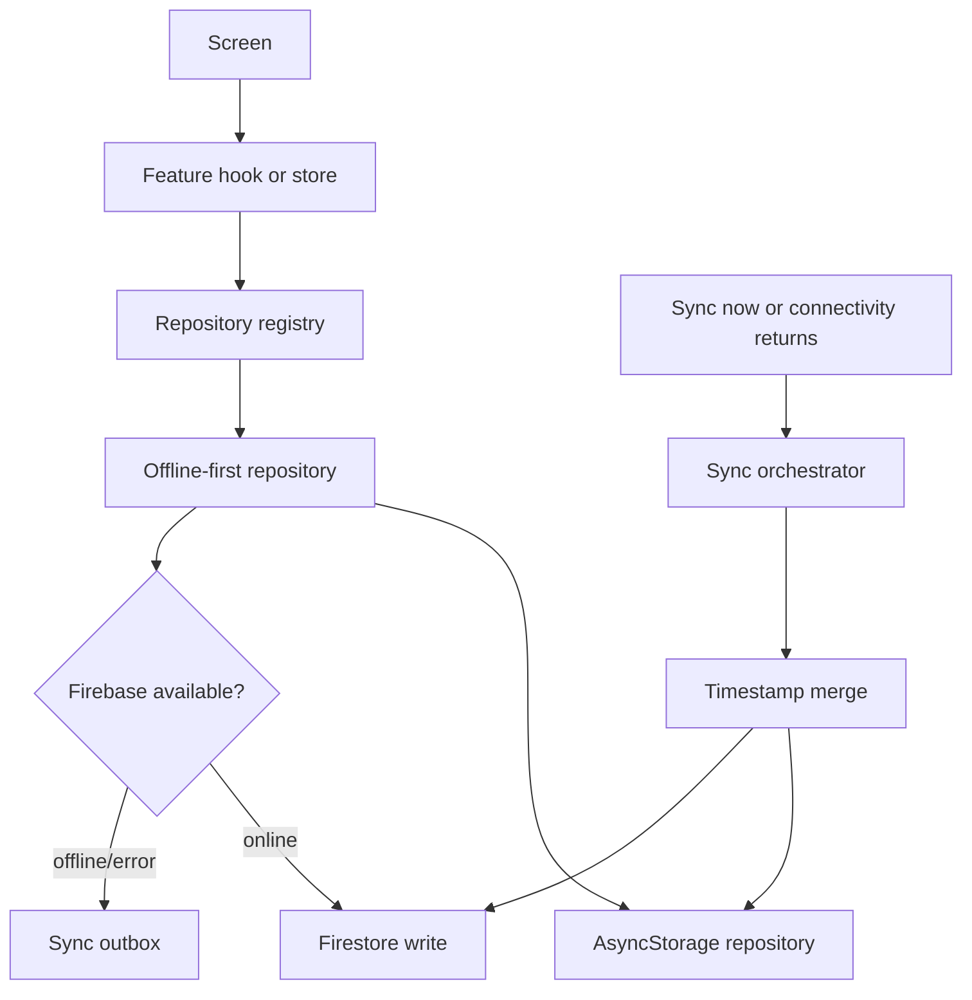

# RMSH Rentals Source Map

This file explains what each source file is responsible for and how the app is wired. Keep it updated when adding, removing, or moving modules.

## App Wiring

## Root Files

| File                                                    | Responsibility                                                                  |
| ------------------------------------------------------- | ------------------------------------------------------------------------------- |
| `App.tsx`                                               | Mounts `AppProvider`; keep app-level wrappers out of feature screens.           |
| `index.js`                                              | React Native entry point registered by the native app.                          |
| `babel.config.js`                                       | Babel setup and import aliases such as `@app`, `@core`, `@features`, `@shared`. |
| `metro.config.js`                                       | Metro bundler configuration.                                                    |
| `jest.config.js` / `jest.setup.ts` / `jest.env.mock.js` | Jest setup, mocks, and test environment configuration.                          |
| `tsconfig.json`                                         | TypeScript compiler options and path aliases.                                   |

## `src/app`

### Navigation

| File                                    | Responsibility                                                         |
| --------------------------------------- | ---------------------------------------------------------------------- |
| `src/app/navigation/RootNavigator.tsx`  | Switches between auth flow and main tabs.                              |
| `src/app/navigation/AuthStack.tsx`      | Login/register stack shown when Firebase auth is required.             |
| `src/app/navigation/BottomTabs.tsx`     | Main app tabs: dashboard, cars, customers, history, more.              |
| `src/app/navigation/DashboardStack.tsx` | Dashboard home and earnings screens.                                   |
| `src/app/navigation/CarsStack.tsx`      | Car list, car details, car form, and car-scoped fine/accident details. |
| `src/app/navigation/CustomersStack.tsx` | Customer list, profile, form, fine, and accident flows.                |
| `src/app/navigation/HistoryStack.tsx`   | History tab: car picker and car rental timeline.                       |
| `src/app/navigation/SettingsStack.tsx`  | More tab: settings, fines, accidents, and related forms/details.       |
| `src/app/navigation/types.ts`           | Typed navigation params for every stack and tab.                       |

### Providers

| File                                | Responsibility                                                                                                                                                         |
| ----------------------------------- | ---------------------------------------------------------------------------------------------------------------------------------------------------------------------- |
| `src/app/providers/AppProvider.tsx` | Top-level runtime wiring: gesture root, safe area, theme, language, Paper, bottom sheets, network gate, auth bootstrap, initial sync, store hydration, global UI host. |
| `src/app/providers/AuthGate.tsx`    | Decides if the app should show auth screens or main tabs based on Firebase configuration and auth status.                                                              |

### Theme

| File                             | Responsibility                                                                                |
| -------------------------------- | --------------------------------------------------------------------------------------------- |
| `src/app/theme/colors.ts`        | Light and dark color palettes.                                                                |
| `src/app/theme/paperTheme.ts`    | React Native Paper light/dark theme objects derived from app colors.                          |
| `src/app/theme/typography.ts`    | Shared text sizes, weights, and line heights. Color belongs in `useThemeContext()` consumers. |
| `src/app/theme/spacing.ts`       | Spacing scale.                                                                                |
| `src/app/theme/radius.ts`        | Border radius scale.                                                                          |
| `src/app/theme/shadows.ts`       | Shadow presets.                                                                               |
| `src/app/theme/buttonMetrics.ts` | Shared button sizing constants.                                                               |
| `src/app/theme/index.ts`         | Theme barrel export.                                                                          |

## `src/contextApis`

| File                                            | Responsibility                                                                          |
| ----------------------------------------------- | --------------------------------------------------------------------------------------- |
| `src/contextApis/theme/ThemeContext.tsx`        | Theme context contract and default values.                                              |
| `src/contextApis/theme/ThemeProvider.tsx`       | Persists and exposes selected light/dark mode, `colors`, Paper theme, and `isDark`.     |
| `src/contextApis/theme/useThemeContext.ts`      | Hook used by screens/components to read theme values.                                   |
| `src/contextApis/language/LanguageContext.tsx`  | Language context contract and supported language option list.                           |
| `src/contextApis/language/LanguageProvider.tsx` | Persists language selection and wires it to i18n. English is currently the only option. |
| `src/contextApis/language/useLanguage.ts`       | Hook used by settings or future language-aware UI.                                      |

## `src/core`

### Config And Constants

| File                               | Responsibility                                       |
| ---------------------------------- | ---------------------------------------------------- |
| `src/core/config/env.ts`           | Safe app-facing environment accessors.               |
| `src/core/config/env.generated.ts` | Generated from `.env`; do not edit manually.         |
| `src/core/constants/app.ts`        | App name and small app-wide labels/helpers.          |
| `src/core/constants/assets.ts`     | Asset references such as the app logo.               |
| `src/core/constants/features.ts`   | Feature flags such as payments/dev tools visibility. |
| `src/core/constants/history.ts`    | Shared history limits and date constants.            |
| `src/core/constants/rental.ts`     | Rental-specific constants.                           |

### Data And Persistence

| File                                                 | Responsibility                                                      |
| ---------------------------------------------------- | ------------------------------------------------------------------- |
| `src/core/data/demoSeedData.ts`                      | Demo records used only by the explicit dev/demo seed flow.          |
| `src/core/data/loadDemoSeedData.ts`                  | Loads demo data into repositories/stores when dev tools request it. |
| `src/core/data/wipeAllAppData.ts`                    | Clears app domain data for dev/reset workflows.                     |
| `src/core/database/baseRepository.ts`                | Generic local repository helpers for entity collections.            |
| `src/core/database/repositoryRegistry.ts`            | Single import point for active repositories used by stores.         |
| `src/core/database/offlineFirstRepositories.ts`      | Offline-first repository wrappers for all domain entities.          |
| `src/core/database/offlineFirstRepositoryHelpers.ts` | Shared offline-first write/read helper logic.                       |
| `src/core/storage/IStorageAdapter.ts`                | Storage adapter interface.                                          |
| `src/core/storage/asyncStorageAdapter.ts`            | AsyncStorage implementation of the storage adapter.                 |
| `src/core/storage/storageKeys.ts`                    | Central list of persisted storage keys.                             |
| `src/core/storage/storageService.ts`                 | Thin typed storage service wrapper.                                 |
| `src/core/storage/zustandPersistStorage.ts`          | Adapter used by Zustand persist middleware for UI preferences.      |
| `src/core/storage/performAppLogout.ts`               | Logout cleanup and local session/domain reset coordination.         |
| `src/core/storage/resetDomainStores.ts`              | Resets all domain Zustand stores in memory.                         |

### Firebase And Sync

| File                                                             | Responsibility                                                                     |
| ---------------------------------------------------------------- | ---------------------------------------------------------------------------------- |
| `src/core/firebase/config/firebaseAppConfig.ts`                  | Initializes Firebase and reports whether cloud features are configured.            |
| `src/core/firebase/auth/services/firebaseAuthService.ts`         | Email/password auth calls.                                                         |
| `src/core/firebase/auth/services/firebaseAuthSessionService.ts`  | Auth session subscription and current-user helpers.                                |
| `src/core/firebase/auth/utils/firebaseAuthErrorUtils.ts`         | Converts Firebase auth errors into user-facing text.                               |
| `src/core/firebase/constants/firestoreCollectionNames.ts`        | Firestore collection names.                                                        |
| `src/core/firebase/services/firebaseAppInitializationService.ts` | Firebase app initialization helper.                                                |
| `src/core/firebase/services/firebaseStorageMediaService.ts`      | Firebase Storage/media helpers.                                                    |
| `src/core/firebase/services/firestoreDatabaseService.ts`         | Firestore database access helper.                                                  |
| `src/core/firebase/services/firestoreDocumentSyncService.ts`     | Generic Firestore document sync reads/writes.                                      |
| `src/core/sync/types/syncTypes.ts`                               | Sync entity/outbox metadata types.                                                 |
| `src/core/sync/repositories/syncMetadataRepository.ts`           | Persists last sync timestamps and related metadata.                                |
| `src/core/sync/repositories/syncOutboxRepository.ts`             | Persists queued writes that could not be pushed immediately.                       |
| `src/core/sync/services/cloudEntityWriteService.ts`              | Pushes entity writes to Firestore.                                                 |
| `src/core/sync/services/cloudMediaSyncService.ts`                | Uploads/syncs media when cloud is available.                                       |
| `src/core/sync/services/entityTimestampMergeService.ts`          | Merges local and cloud records using timestamps.                                   |
| `src/core/sync/services/networkConnectivityService.ts`           | Connectivity checks used by sync.                                                  |
| `src/core/sync/services/offlineFirstSyncOrchestratorService.ts`  | Full sync pipeline: push outbox, pull cloud, merge, persist.                       |
| `src/core/store/useCloudSyncStore.ts`                            | Zustand state for sync status, pending count, metadata, and connectivity listener. |

### Business Rules And Helpers

| File                                              | Responsibility                                                                               |
| ------------------------------------------------- | -------------------------------------------------------------------------------------------- |
| `src/core/services/availabilityService.ts`        | Derives car availability, on-rent, returning-soon, and upcoming-booking status from rentals. |
| `src/core/services/bookingConflictService.ts`     | Detects overlapping bookings for the same car.                                               |
| `src/core/services/rentalBillingService.ts`       | Builds payment installment schedules for daily/weekly/monthly rent.                          |
| `src/core/services/rentalScheduleService.ts`      | Creates rental and payment records from assignment input.                                    |
| `src/core/services/updateRentalEndDateService.ts` | Validates and updates an active rental end date.                                             |
| `src/core/helpers/androidMediaPermissions.ts`     | Android permission helpers for image/media access.                                           |
| `src/core/helpers/bottomSheetSnapHeight.ts`       | Calculates bottom sheet snap heights.                                                        |
| `src/core/helpers/customerPaymentStatus.ts`       | Computes customer payment status badges.                                                     |
| `src/core/helpers/date.ts`                        | Shared date formatting helpers.                                                              |
| `src/core/helpers/historyDates.ts`                | Min/max date logic for history forms.                                                        |
| `src/core/helpers/id.ts`                          | ID generation helper.                                                                        |
| `src/core/helpers/paymentInstallment.ts`          | Payment due labels and installment state helpers.                                            |
| `src/core/helpers/rentalDisplay.ts`               | Rental display text and date/time merging helpers.                                           |
| `src/core/helpers/rentalHistory.ts`               | Builds monthly car rental/free-period timeline data.                                         |
| `src/core/helpers/rentalPayments.ts`              | Paid/pending totals and rental payment calculations.                                         |
| `src/core/helpers/screenBottomInset.ts`           | Bottom spacing to avoid tab bar overlap.                                                     |
| `src/core/helpers/upcomingEarnings.ts`            | Groups pending payments by year/month for dashboard earnings.                                |
| `src/core/hooks/useBottomSheetLayoutMetrics.ts`   | Device-aware bottom sheet sizing metrics.                                                    |
| `src/core/hooks/useBottomSheetModal.ts`           | Small helper for bottom sheet modal open/close state.                                        |
| `src/core/hooks/useDebouncedValue.ts`             | Debounces rapidly changing values such as search text.                                       |
| `src/core/hooks/useDeviceLayout.ts`               | Phone/tablet layout metrics and horizontal padding.                                          |
| `src/core/hooks/useHydrateStores.ts`              | Hydrates all domain stores from repositories.                                                |
| `src/core/hooks/useOptionalBottomTabBarHeight.ts` | Safely reads tab bar height when inside tabs.                                                |
| `src/core/i18n/index.ts`                          | i18next setup and translation hook exports.                                                  |
| `src/core/types/domain.ts`                        | Main domain models: car, customer, rental, payment, fine, accident.                          |
| `src/core/types/media.ts`                         | Media URI/type definitions.                                                                  |
| `src/core/utils/currency.ts`                      | Currency formatting helper.                                                                  |

## `src/features`

### Auth

| File                                                  | Responsibility                                                                |
| ----------------------------------------------------- | ----------------------------------------------------------------------------- |
| `src/features/auth/components/AuthScreenLayout.tsx`   | Shared auth screen shell with logo, card, optional back button/banner/footer. |
| `src/features/auth/hooks/useFirebaseAuthBootstrap.ts` | Subscribes to Firebase auth state and keeps auth store current.               |
| `src/features/auth/screens/LoginScreen.tsx`           | Login form and session-expired banner.                                        |
| `src/features/auth/screens/RegisterScreen.tsx`        | Registration form.                                                            |
| `src/features/auth/store/useFirebaseAuthStore.ts`     | Firebase auth session/status Zustand store.                                   |

### Cars

| File                                                        | Responsibility                                                    |
| ----------------------------------------------------------- | ----------------------------------------------------------------- |
| `src/features/cars/components/CarCard.tsx`                  | Car row/card used in car lists.                                   |
| `src/features/cars/components/CarPhotosSection.tsx`         | Car detail photo gallery section.                                 |
| `src/features/cars/hooks/useCarFormData.ts`                 | Loads and prepares car form data.                                 |
| `src/features/cars/hooks/useFilteredCars.ts`                | Applies car search and filter rules.                              |
| `src/features/cars/navigation/openCarsListWithFilter.ts`    | Cross-tab helper for opening Cars with a preselected filter.      |
| `src/features/cars/repository/ICarRepository.ts`            | Car repository interface.                                         |
| `src/features/cars/repository/asyncStorageCarRepository.ts` | Local AsyncStorage car repository.                                |
| `src/features/cars/screens/CarsListScreen.tsx`              | Cars tab list, search, filters, and add navigation.               |
| `src/features/cars/screens/CarDetailsScreen.tsx`            | Car profile, rental assignment, history, photos, fines/accidents. |
| `src/features/cars/screens/CarFormScreen.tsx`               | Add/edit car form.                                                |
| `src/features/cars/store/useCarStore.ts`                    | Car entity Zustand store and CRUD actions.                        |
| `src/features/cars/store/useCarFilterStore.ts`              | Persisted UI state for car list search/filter.                    |

### Customers

| File                                                                  | Responsibility                                                 |
| --------------------------------------------------------------------- | -------------------------------------------------------------- |
| `src/features/customers/components/CustomerPaymentHistory.tsx`        | Customer payment history section.                              |
| `src/features/customers/components/CustomerFineHistory.tsx`           | Customer fine history section.                                 |
| `src/features/customers/components/CustomerAccidentHistory.tsx`       | Customer accident history section.                             |
| `src/features/customers/helpers/customerLicenseDisplay.ts`            | License label formatting.                                      |
| `src/features/customers/helpers/resolveCustomerCarId.ts`              | Finds the best car linked to a customer from rentals.          |
| `src/features/customers/hooks/useCustomerRentalInfo.ts`               | Aggregates active/upcoming/latest rental info for a customer.  |
| `src/features/customers/hooks/useFilteredCustomers.ts`                | Applies customer search/filter rules.                          |
| `src/features/customers/repository/ICustomerRepository.ts`            | Customer repository interface.                                 |
| `src/features/customers/repository/asyncStorageCustomerRepository.ts` | Local AsyncStorage customer repository.                        |
| `src/features/customers/screens/CustomersListScreen.tsx`              | Customer tab list and search.                                  |
| `src/features/customers/screens/CustomerProfileScreen.tsx`            | Customer details, payments, fines, accidents, edit navigation. |
| `src/features/customers/screens/CustomerFormScreen.tsx`               | Add/edit customer form and license image upload.               |
| `src/features/customers/services/customerLicenseAutofillService.ts`   | Maps OCR output into customer form fields.                     |
| `src/features/customers/services/customerLicenseOcrService.ts`        | Reads license images for customer autofill.                    |
| `src/features/customers/store/useCustomerStore.ts`                    | Customer entity Zustand store and CRUD actions.                |

### Rentals And Payments

| File                                                                | Responsibility                                                      |
| ------------------------------------------------------------------- | ------------------------------------------------------------------- |
| `src/features/rentals/repository/IRentalRepository.ts`              | Rental repository interface.                                        |
| `src/features/rentals/repository/asyncStorageRentalRepository.ts`   | Local AsyncStorage rental repository.                               |
| `src/features/rentals/store/useRentalStore.ts`                      | Rental entity store and assignment/end-date actions.                |
| `src/features/rentals/types/assignRental.ts`                        | Assignment flow input types.                                        |
| `src/features/payments/repository/IPaymentRepository.ts`            | Payment repository interface.                                       |
| `src/features/payments/repository/asyncStoragePaymentRepository.ts` | Local AsyncStorage payment repository.                              |
| `src/features/payments/store/usePaymentStore.ts`                    | Payment entity store and hydration/reset actions.                   |
| `src/features/payments/hooks/usePaymentInstallmentActions.ts`       | Handles received/not-paid payment actions with loading/error state. |

### Dashboard

| File                                                             | Responsibility                                                              |
| ---------------------------------------------------------------- | --------------------------------------------------------------------------- |
| `src/features/dashboard/components/StatCard.tsx`                 | Dashboard metric card.                                                      |
| `src/features/dashboard/components/EarningsCarSectionHeader.tsx` | Earnings-specific collapsible car header.                                   |
| `src/features/dashboard/components/EarningsHireCard.tsx`         | Earnings-specific hire summary row.                                         |
| `src/features/dashboard/helpers/buildCarEarningsSections.ts`     | Builds per-car earnings sections.                                           |
| `src/features/dashboard/helpers/buildEarningsListItems.ts`       | Flattens expandable earnings sections for FlashList.                        |
| `src/features/dashboard/helpers/filterCarEarningsSections.ts`    | Filters earnings sections by search text.                                   |
| `src/features/dashboard/screens/DashboardScreen.tsx`             | Home dashboard stats, recent bookings, and earnings entry points.           |
| `src/features/dashboard/screens/EarningsBreakdownScreen.tsx`     | Searchable paid/pending earnings by car and hire.                           |
| `src/features/dashboard/screens/UpcomingEarningsScreen.tsx`      | Pending payments grouped by month for selected year.                        |
| `src/features/dashboard/screens/SettingsScreen.tsx`              | More tab settings: sync, dev data tools, theme, language, fines, accidents. |

### Fines And Accidents

| File                                                                  | Responsibility                                                  |
| --------------------------------------------------------------------- | --------------------------------------------------------------- |
| `src/features/fines/repository/IFineRepository.ts`                    | Fine repository interface.                                      |
| `src/features/fines/repository/asyncStorageFineRepository.ts`         | Local AsyncStorage fine repository.                             |
| `src/features/fines/screens/FinesListScreen.tsx`                      | Fine list screen.                                               |
| `src/features/fines/screens/FineDetailsScreen.tsx`                    | Fine details screen.                                            |
| `src/features/fines/screens/FineFormScreen.tsx`                       | Add/edit fine form, document OCR, rental/customer/car autofill. |
| `src/features/fines/services/fineDocumentAutofillService.ts`          | Resolves OCR extraction into fine form fields.                  |
| `src/features/fines/services/fineDocumentOcrService.ts`               | Reads fine document images for autofill.                        |
| `src/features/fines/store/useFineStore.ts`                            | Fine entity Zustand store and CRUD actions.                     |
| `src/features/accidents/repository/IAccidentRepository.ts`            | Accident repository interface.                                  |
| `src/features/accidents/repository/asyncStorageAccidentRepository.ts` | Local AsyncStorage accident repository.                         |
| `src/features/accidents/screens/AccidentsListScreen.tsx`              | Accident list screen.                                           |
| `src/features/accidents/screens/AccidentDetailsScreen.tsx`            | Accident details screen.                                        |
| `src/features/accidents/screens/AccidentFormScreen.tsx`               | Add accident form and optional customer blacklist action.       |
| `src/features/accidents/store/useAccidentStore.ts`                    | Accident entity Zustand store and CRUD actions.                 |

### History

| File                                                        | Responsibility                                   |
| ----------------------------------------------------------- | ------------------------------------------------ |
| `src/features/history/components/HistoryMonthAccordion.tsx` | Expandable month section for car rental history. |
| `src/features/history/hooks/useHistoryFilteredCars.ts`      | Search/filter helper for history car picker.     |
| `src/features/history/screens/HistoryCarsListScreen.tsx`    | History tab car picker.                          |
| `src/features/history/screens/CarRentalHistoryScreen.tsx`   | Per-car yearly rental/free-period timeline.      |

## `src/shared`

| File                                            | Responsibility                                                                |
| ----------------------------------------------- | ----------------------------------------------------------------------------- |
| `src/shared/ui/AppButton.tsx`                   | Theme-aware app button.                                                       |
| `src/shared/ui/AppDialog.tsx`                   | Shared Paper dialog shell used by global and feature dialogs.                 |
| `src/shared/ui/AppDropdown.tsx`                 | Theme-aware dropdown control.                                                 |
| `src/shared/ui/AppInput.tsx`                    | Theme-aware form input with icon/password support.                            |
| `src/shared/ui/AppDatePickerModal.tsx`          | Shared date/time picker modal.                                                |
| `src/shared/ui/CollapsibleSection.tsx`          | Generic expandable section wrapper.                                           |
| `src/shared/ui/EmptyState.tsx`                  | Empty-state presentation.                                                     |
| `src/shared/ui/GlobalUiHost.tsx`                | Global loader, toast, and modal host.                                         |
| `src/shared/ui/PaymentInstallmentActions.tsx`   | Received/not-paid action controls for payment rows.                           |
| `src/shared/ui/ReadOnlyFormField.tsx`           | Read-only form field presentation.                                            |
| `src/shared/ui/SearchBar.tsx`                   | Plug-and-play themed search field.                                            |
| `src/shared/ui/SearchHeader.tsx`                | Search bar with optional filter action.                                       |
| `src/shared/ui/SelectableList.tsx`              | Single/multi-select list used by filters and pickers.                         |
| `src/shared/ui/StatusBadge.tsx`                 | Theme-aware status badge variants.                                            |
| `src/shared/ui/TimelineView.tsx`                | Simple vertical timeline renderer.                                            |
| `src/shared/ui/WeekdayPicker.tsx`               | Weekday picker control for rent schedules.                                    |
| `src/shared/ui/index.ts`                        | Shared UI barrel export.                                                      |
| `src/shared/layouts/ScreenLayout.tsx`           | Standard scrollable screen shell with refresh and safe spacing.               |
| `src/shared/layouts/ResponsiveContainer.tsx`    | Width-constrained responsive wrapper.                                         |
| `src/shared/layouts/ScreenSection.tsx`          | Reusable screen section wrapper.                                              |
| `src/shared/layouts/screenStyles.ts`            | Theme-neutral shared spacing/layout styles. Add runtime colors in components. |
| `src/shared/bottomSheets/AppBottomSheet.tsx`    | Base bottom sheet wrapper.                                                    |
| `src/shared/bottomSheets/FilterBottomSheet.tsx` | Single/multi-select filter bottom sheet.                                      |
| `src/shared/media/MediaUploader.tsx`            | Image selection/upload control.                                               |
| `src/shared/media/ImageSlider.tsx`              | Swipeable image preview slider.                                               |
| `src/shared/media/ImageViewerModal.tsx`         | Full-screen image viewer.                                                     |
| `src/shared/media/reportImageLoadError.ts`      | Media image-load error logging helper.                                        |
| `src/shared/media/index.ts`                     | Media barrel export.                                                          |
| `src/shared/modals/AssignmentModal.tsx`         | Rental assignment modal for car details.                                      |
| `src/shared/modals/SetRentalEndModal.tsx`       | Active rental end-date update modal.                                          |
| `src/shared/modals/modalFormStyles.ts`          | Theme-neutral modal form spacing/label styles.                                |

## `src/error`, `src/network`, `src/locales`, `src/zustand`, `src/types`

| File                                        | Responsibility                                                      |
| ------------------------------------------- | ------------------------------------------------------------------- |
| `src/error/ErrorBoundary.tsx`               | React error boundary wrapper.                                       |
| `src/error/ErrorFallbackScreen.tsx`         | User-facing fallback UI after an app error.                         |
| `src/error/apiErrorParser.ts`               | Normalizes API/Firebase-style errors.                               |
| `src/error/errorHandler.ts`                 | Central error handling helper.                                      |
| `src/error/errorLogger.ts`                  | Error logging helper.                                               |
| `src/network/NetworkProvider.tsx`           | Provides network status to the app.                                 |
| `src/network/NetworkGate.tsx`               | Shows offline UI when network requirements block the current route. |
| `src/network/NoInternetScreen.tsx`          | Offline screen.                                                     |
| `src/network/networkService.ts`             | NetInfo integration.                                                |
| `src/network/networkTypes.ts`               | Network state types.                                                |
| `src/network/useNetworkStatus.ts`           | Hook for network status.                                            |
| `src/locales/en.json`                       | English translation strings.                                        |
| `src/zustand/useLoaderStore.ts`             | Global loading overlay state.                                       |
| `src/zustand/useModalStore.ts`              | Global modal state.                                                 |
| `src/zustand/useToastStore.ts`              | Global toast state.                                                 |
| `src/types/firebase-auth-react-native.d.ts` | Firebase auth React Native type declarations.                       |
| `src/types/i18n.d.ts`                       | i18n type declarations.                                             |
| `src/types/react-native-vector-icons.d.ts`  | Vector icon type declarations.                                      |

## Rules Of Thumb

- Screens read/write domain data through feature stores, not AsyncStorage or Firestore.
- Stores use `repositories` from `src/core/database/repositoryRegistry.ts`.
- Business logic belongs in `src/core/services` or `src/core/helpers`, with tests when rules matter.
- Cross-screen UI belongs in `src/shared`, not copied into feature screens.
- Colors in components should come from `useThemeContext()`; shared style modules should stay theme-neutral unless they are inside theme infrastructure.
- Translation strings belong in `src/locales/en.json`; use `useTranslation()` in UI.
